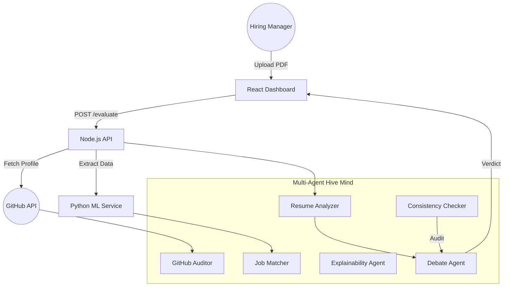

# 🚀 HireSync AI: Multi-Agent Hiring Ecosystem

HireSync AI is a state-of-the-art, decentralized hiring platform that moves beyond simple keyword matching. It utilizes a **Multi-Agent Orchestration Layer** to perform deep-dive technical assessments of candidates by auditing resumes against real-world GitHub contributions.


---

## 🧠 System Architecture



---

## ✨ Key Features
- **Integrity Auditing**: Automatically cross-references resume claims (e.g., "5 years of Python") against actual GitHub commit history and repository languages.
- **AI Recruiter Debate**: Simulates a conference room where 3 distinct AI recruiter personas argue over the candidate's viability to find the ultimate truth.
- **Premium UX/UI**: A fluid, obsidian-themed dashboard powered by **Framer Motion** and **Tailwind CSS**.
- **Dynamic Matching**: Real-time evaluation against custom, ad-hoc job descriptions typed by the user.

---

## 🛠️ Detailed Setup Instructions

### 1. Prerequisites
Ensure you have the following installed on your machine:
- **Node.js** (v18.x or higher)
- **Python** (v3.10 or higher)
- **MongoDB** (Running locally on the default port `27017`)
- **Git**

### 2. Repository Configuration
Clone the repository and enter the root directory:
```bash
git clone https://github.com/NARESH-SAI-ARAVIND-S-142/AI-HIRING-ASSISTANT.git
cd AI-HIRING-ASSISTANT
```

### 3. Environment Variables
Create a `.env` file in the root directory. You can use `.env.example` as a template:
```env
PORT=3001
MONGO_URI=mongodb://127.0.0.1:27017/ai-hiring
ML_SERVICE_URL=http://localhost:8000

# Critical Credentials
GROQ_API_KEY=your_groq_api_key_here
GITHUB_TOKEN=your_github_personal_access_token_here
```
> [!IMPORTANT]
> To get a `GITHUB_TOKEN`, visit [GitHub Token Settings](https://github.com/settings/tokens). This is required to bypass rate limits and fetch detailed profile data.

### 4. Component Installation & Startup

#### A. Python ML Service (Port 8000)
This service handles PDF parsing and mathematical feature scoring.
```bash
cd ml-service
python -m venv venv
source venv/bin/activate  # On Windows: .\venv\Scripts\activate
pip install -r requirements.txt
uvicorn main:app --reload
```

#### B. Node.js Backend Server (Port 3001)
This is the orchestrator that runs the AI agents and talks to MongoDB.
```bash
cd backend
npm install
npm run dev
```

#### C. React Frontend Dashboard (Port 5173)
The visual interface for monitoring the evaluation process.
```bash
cd frontend
npm install
npm run dev
```

---

## 🚀 Usage Guide

1. **Dashboard**: Navigate to `http://localhost:5173`.
2. **Evaluate**: Click the **"Evaluate"** link in the floating navigation bar.
3. **Upload**: Drag and drop a candidate's resume (PDF format).
4. **Dynamic Context**: Type the specific requirements for the role (e.g., "Senior Node.js Developer with AWS expertise").
5. **Process**: Watch the **Agent Progress Animation**. The 6 agents will slide in sequentially as they finish their specific tasks.
6. **Analyze**: Explore the results in the Dashboard, including the AI Recruiter Chatbubbles and the Integrity Audit report.

---

## 🤝 Attribution
**Author**: NARESH-SAI-ARAVIND-S-142
**Platform**: Developed as a premium hiring solution with Multi-Agent Hive Logic.

---

## 📜 License
Distibuted under the MIT License. See `LICENSE` for more information.
